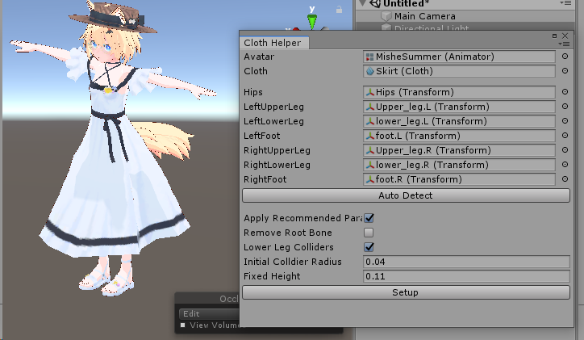

# UnityClothSkirtHelper
UnityのClothコンポーネントを使ってスカートを作る作業を簡略化するエディタ拡張。VRChat向け。

開き方
* メニュー: EsnyaTools > Cloth Skirt Helper
* Clothコンポーネント右クリック > Cloth Skirt Helper

おまけツール：Mesh Cleaner
SkinnedMeshRenderer　から使われていない頂点を削除する。
